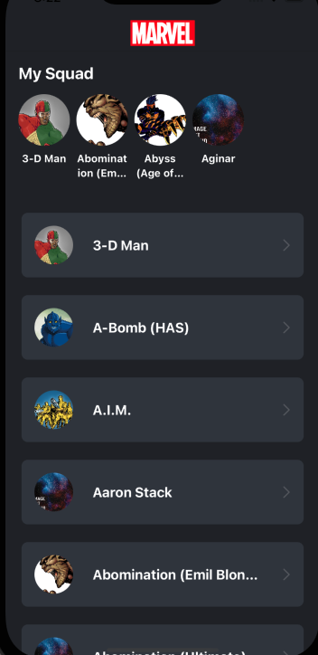
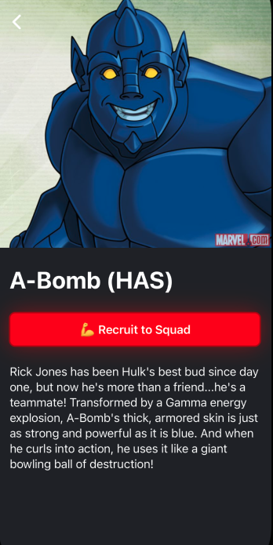
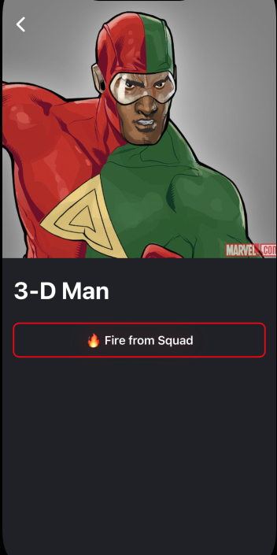

# Overview
**The Superhero Squad Maker**
The fundamental basis of any squad, is a team of kick-ass superheroes. Hence this task, **The Superhero Squad Maker.** Your mission is to build the ultimate superhero squad using the [Marvel API](https://developer.marvel.com/) for data. The app should list all the marvel characters and the user should be able to **Recruit** or **Fire** characters from their squad.

                  

## Usage and Requirements:
* Xcode 14.2 with Swift 5
* iOS 15
* [Marvel API](https://developer.marvel.com/) private and public keys

## Development Info
- **SwiftUI**
- **MVVM** design pattern
- **Combine** for declarative API Calls
- **Core Data** for persistence layer
- **CachedAsyncImage** package for loading app's images
- **XCTest** for unit testing
